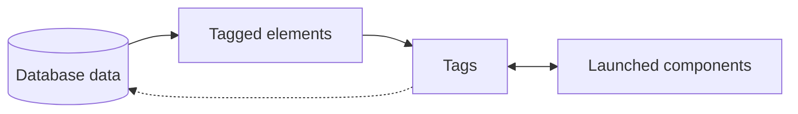

import Tabs from '@theme/Tabs';
import TabItem from '@theme/TabItem';

# Core Concepts

The components that make up Launched.

## Structure

An important thing to note about Launched is that it is **not a database**. Instead, it's a layer that sits on top of your existing database. It handles all of the data management and editing within the browser, then returns the data to you to save to your database.

:::note

Because Launched is completely isolated from your database, you can use any database as you want, as long as you handle the data fetching and saving yourself. This makes static HTML more of a hassle; see [usage](/Usage) for more information.

:::

### Data Flow

Data passes through Launched in the following pattern:

<br/>

<br/>

Let's break it down:

1. **Database data**: This is the data that you fetch from your database. It's the raw data that you use to populate your website.
2. **Tagged elements**: This is the [tagged content](#tagging) that is rendered from your database data.
3. **Tags**: These are the elements that you want to make editable. They expose their content to Launched.
4. **Launched components**: These are the components that make your content editable. They pass updated data back to the tags.

### Caviats

- **Launched does not store your data**- it only manages it in the browser. You must save the data to your database yourself.
- **Launched does not handle authentication**- you must handle this yourself.
- **Launched does not handle data validation**- you must secure and validate your data yourself, ideally on the server.

## Tagging

A tag is a unique identifier for a piece of content. Tags expose elements and their content to Launched to make them editable.

### Tags

Every tag has a unique name, a data type, a value, and an associated HTML element. They're stored in the following format:

```js
{
  data: {
    type: string;
    value: TagValue;
  },
  setData: ...,
  el: HTMLElement;
}
```
